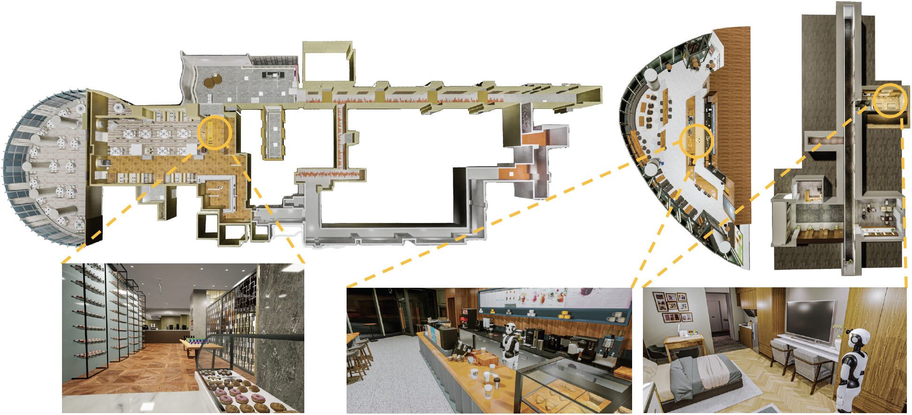
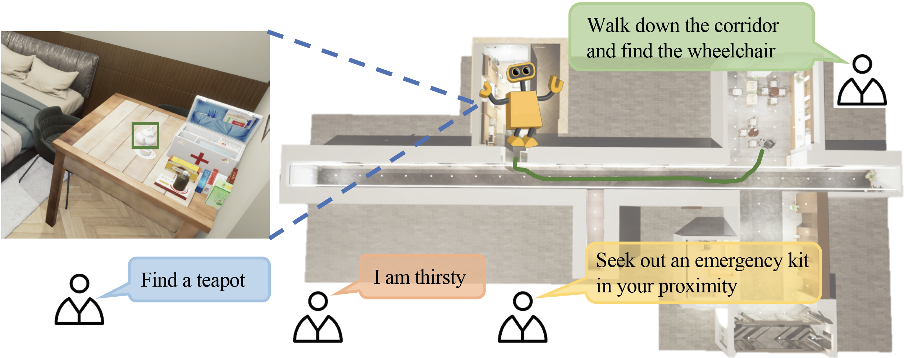

# MO-VLN: A Multi-Task Benchmark for Open-set Zero-Shot Vision-and-Language Navigation

This is a PyTorch implementation of the [paper](https://arxiv.org/abs/2306.10322).

Project website: https://mligg23.github.io/MO-VLN-Site/


### Update


<details>
<summary>8/17/2023</summary>
 We have released [**version 1.1**](https://drive.google.com/drive/folders/1padFHXi9VrTfDR2_8UmxB8NyZf2NfiZB?usp=drive_link) of the MO-VLN benchmark simulator.

- Added **walker control interface**.
- Added many different states of pedestrians, including **different gender, different skin colors, and different ages of 50 walkers with smooth walking or running movements**

- **Added 1k+ instructions** to our four tasks.
- Two **new scenes have been added**, bringing the total to five:
  - Coffee
  - Restaurant
  - Nursing Room
  - **Home scene** -- A home suite consisting of a living room, kitchen, dining room, and multiple bedrooms
  - **Separate tables** -- Multiple tables can provide a large and efficient grasping parallel training
- Support for **grabbing and navigation tasks**.
</details>

<details>
<summary>6/18/2023</summary>
 We have released [**version 1.0**](https://drive.google.com/drive/folders/1PijMeLZV6OUvB7HZIJph0bbsMfZWx9YJ?usp=drive_link) of the MO-VLN benchmark simulator.

- Built on UE5.
- 3 scene types:
  - Coffee -- One-to-one modeling in a Coffee
  - Restaurant -- One-to-one modeling in a restaurant
  - Nursing Room -- One-to-one modeling in a Nursing Room
- Support for navigation tasks.
- With **real light and shadow characteristics**
- Support **129 classes** for navigation testing
- Support instruction tasks with **four tasks**: 
  - goal-conditioned navigation given a specific object category (e.g., "fork"); 
  - goal-conditioned navigation given simple instructions (e.g., "Search for and move towards a tennis ball"); 
  - step-by-step instructions following; 
  - finding abstract objects based on high-level instruction (e.g., "I am thirsty").
</details>

<details>
<summary>To-Do List</summary>
- Develop and make **more scenes**.
- Provide **more classes of generative objects**.
- Continue to update the simulator's **physics engine effects** to achieve more **realistic dexterous hand-grabbing effects**
- Adding **more interactive properties to objects in the environment**, such as a coffee machine that can be controlled to make coffee.
</details>

## Overview
MO-VLN provides four tasks: 1) goal-conditioned navigation given a specific object category (e.g., "fork"); 2) goal-conditioned navigation given simple instructions (e.g., "Search for and move towards a tennis ball"); 3) step-by-step instruction following; 4) finding abstract object based on high-level instruction (e.g., "I am thirsty"). The earlier version of our simulator covers three high-quality scenes: cafe, restaurant, and nursing house.






## Installing Dependencies
- Installing the simulator following [here](https://mligg23.github.io/MO-VLN-Site/Simulation%20Environment%20API.html).

- Installing [GLIP](https://github.com/microsoft/GLIP).

- Installing [Grounded-SAM](https://github.com/IDEA-Research/Grounded-Segment-Anything).


## Setup
Clone the repository and install other requirements:
```
git clone https://github.com/liangcici/MO-VLN.git
cd MO-VLN/
pip install -r requirements.txt
```

### Setting up dataset
- Downloading original datasets from [here](https://drive.google.com/drive/folders/1khtQ9zRfWQX0WtsMWq3NkRNMvjH0JiZi).

- Generate data for ObjectNav (goal-conditioned navigation given a specific object category).
```
python data_preprocess/gen_objectnav.py --map_id 3
```
map_id indicates specific scene: `{3: Starbucks; 4: TG; 5: NursingRoom}`.


## Usage
The implementation is based on frontier-based exploration (FBE). Exploration with commonsense knowledge as in our paper is based on [ESC](https://sites.google.com/ucsc.edu/escnav/home), which is not allowed to be released. `dataset/objectnav/*.npy` are knowledge extracted from LLMs, and can be used to reproduce exploration with commonsense knowledge.

Run models with FBE:

- For ObjectNav:
```
python zero_shot_eval.py --sem_seg_model_type glip --map_id 3
```


## Related Projects
- The Semantic Mapping module is based on [SemExp](https://github.com/devendrachaplot/Object-Goal-Navigation).


## Citation
```
@article{liang2023mo,
  title={MO-VLN: A Multi-Task Benchmark for Open-set Zero-Shot Vision-and-Language Navigation},
  author={Liang, Xiwen and Ma, Liang and Guo, Shanshan and Han, Jianhua and Xu, Hang and Ma, Shikui and Liang, Xiaodan},
  journal={arXiv preprint arXiv:2306.10322},
  year={2023}
}
```
